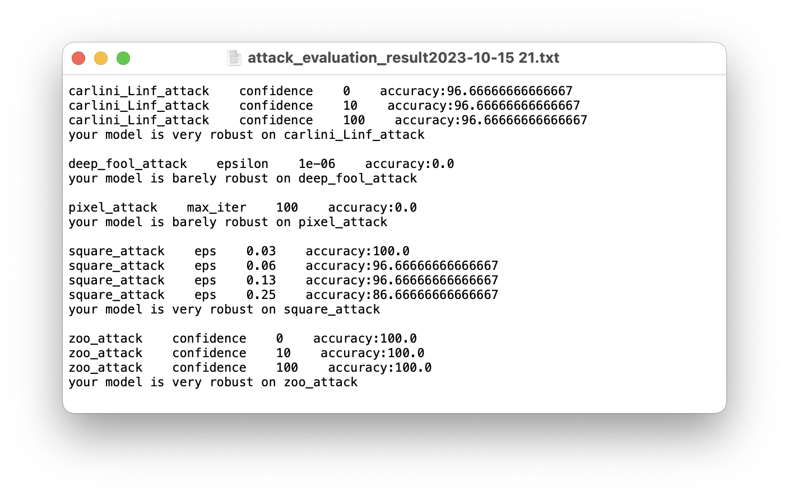
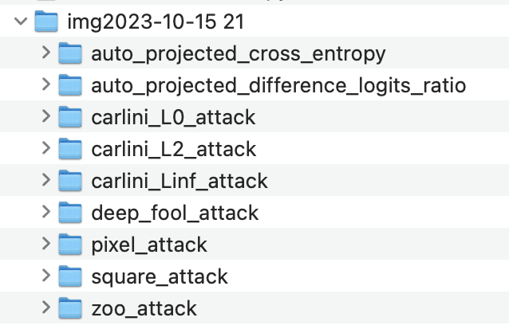

<p align="center">
  <a href="https://uoa-compsci399-s2-2023.github.io/capstone-project-team-7/">
    
  </a>
</p>

<h2 align="center">Adversarial Insight ML (AIML)</h2>

<p align="center">
  <a href="https://pypi.org/project/adversarial-insight-ml/">
    
  </a>
 <a href="https://www.python.org/downloads/">
    
  </a>
  <a href="https://opensource.org/licenses/MIT">
    
  <a href="https://github.com/psf/black">
    
  </a>
  <a href="https://uoa-compsci399-s2-2023.github.io/capstone-project-team-7/">
    
  </a>
</p>

> “Why does your machine lie?”

Adversarial Insight ML (AIML) is a PyPI package that evaluates the robustness of machine learning models in image classification against adversarial attacks. The final program in the package should automatically test potential adversarial attacks against each given machine learning model and give users accurate, efficient and robust feedback through several benchmarks we develop. Furthermore, the package should be designed to allow non-technical users to use it as well.

For more information, you can also visit the [PyPI page](https://pypi.org/project/adversarial-insight-ml/) and [documentation](https://uoa-compsci399-s2-2023.github.io/capstone-project-team-7/).

## Table of Contents

- [Installation](#installation)
- [Usage](#usage)
- [Features](#features)
- [Contributing](#contributing)
- [License](#license)

## Installation

To install Adversarial Insight ML, you can use pip:

```bash
pip install adversarial-insight-ml
```

## Usage

Here's a simple overview of the usage of our package:
<p align="center">
  
</p>

You can evaluate your model with the `evaluate()` function:

```python
from aiml.evaluation.evaluate import evaluate

evaluate(model, test_dataset)
```

The `evaluate()` function has **two required parameters**:
- `input_model (str or model)`: A string of the name of the machine learning model or the machine learning model itself.
- `input_test_data (str or dataset)`: A string of the name of the testing dataset or the testing dataset itself.

The `evaluate()` function has the following **optional parameters**:
- `input_train_data (str or dataset, optional)`: A string of the name of the training dataset or the training dataset itself (default is None).
- `input_shape (tuple, optional)`: Shape of input data (default is None).
- `clip_values (tuple, optional)`: Range of input data values (default is None).
- `nb_classes (int, optional)`: Number of classes in the dataset (default is None).
- `batch_size_attack (int, optional)`: Batch size for attack testing (default is 64).
- `num_threads_attack (int, optional)`: Number of threads for attack testing (default is 0).
- `batch_size_train (int, optional)`: Batch size for training data (default is 64).
- `batch_size_test (int, optional)`: Batch size for test data (default is 64).
- `num_workers (int, optional)`: Number of workers to use for data loading (default is half of the available CPU cores).
- `dry (bool, optional)`: When True, the code should only test one example.
- `attack_para_list (list, optional)`: List of parameter combinations for the attack.

See the demos in `examples/` directory for usage in action:
- [demo_basic](examples/demo_basic.ipynb)
- [demo_huggingface](examples/demo_huggingface.ipynb)
- [demo_robustbench](examples/demo_robustbench.ipynb)

## Features

After evaluating your model with `evaluate()` function, we provide
the following insights:

- Summary of adversarial attacks performed, found in `attack_evaluation_result.txt`:
  
- Samples of the images can be found in `img/` directory, for example:
  <p align="center">
    
    
  </p>


## Contributing

**Code Style**  
Always adhere to the [PEP 8](https://www.python.org/dev/peps/pep-0008/) style guide for writing Python code, allowing upto 99 characters per line as the absolute maximum. Alternatively, just use [black](https://github.com/psf/black).

**Commit Messages**  
When making changes to the codebase, please refer to the [Documentation/SubmittingPatches](https://git.kernel.org/pub/scm/git/git.git/tree/Documentation/SubmittingPatches?h=v2.36.1#n181) in the Git repo:

- Write commit messages in present tense and imperative mood, e.g., "Add feature" instead of "Added feature" or "Adding feature."
- Craft your messages as if you're giving orders to the codebase to change its behaviour.

**Branching**  
We conform to a variation of the "GitHub Flow'' convention, but not strictly. For example, see the following types of branches:

- main: This branch is always deployable and reflects the production state.
- bugfix/\*: For bug fixes.

## License

This project is licensed under the MIT License - see the [LICENSE](LICENSE) file for details.

## Acknowledgements

We extend our sincere appreciation to the following individuals who have been instrumental in the success of this project:

Firstly, our client Mr. Luke Chang. His invaluable guidance and insights guided us from the beginning through every phase, ensuring our work remained aligned with practical needs. This project would not have been possible without his efforts.

We'd also like to express our gratitude to Dr. Asma Shakil, who has coordinated and provided an opportunity for us to work together on this project.

Thank you for being part of this journey.

Warm regards,
Team 7

## Contacts

Sungjae Jang sjan260@aucklanduni.ac.nz  
Takuya Saegusa tsae032@aucklanduni.ac.nz  
Haozhe Wei hwei313@aucklanduni.ac.nz  
Yuming Zhou yzho739@aucklanduni.ac.nz  
Terence Zhang tzha820@aucklanduni.ac.nz
